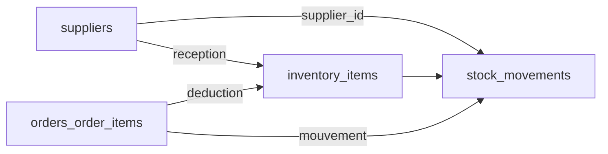

# État des lieux : ce qui est relié, ce qui ne l’est pas

Documentation d’architecture (MansaVibes) — relations entre stock, fournisseurs, commandes et e-commerce.

## Isolation par atelier (tenant)

Tout le métier partage le même principe : une colonne **`tenant_id`** sur les tables (`App\Models\Concerns\BelongsToTenant`). Les données d’un atelier sont **isolées** en base. Ce n’est pas une synchronisation fonctionnelle entre modules : c’est du **multi-tenant**.

## Flux stock (fournisseurs, inventaire, commandes)

| Zone | Rôle |
|------|------|
| **Réceptions fournisseur** | `InventoryInboundReceiptService` : entrée de stock (article simple ou **tissu léger** = ajout sur une ligne « nombre » + recalcul du total). `stock_movements` positifs, `supplier_id` + `reference`. |
| **Actualiser** | Saisie manuelle des quantités / caractéristiques (`InventoryWebController::refreshUpdate`). |
| **Commande** | `order_items` : `inventory_item_id` optionnel ; pour **tissu léger** : `inventory_characteristic_key` + `inventory_consumed_meters`. |
| **Déduction** | `OrderInventoryDeductionService` : **une fois** par commande (`orders.inventory_deducted_at`). **Automatique** au passage en statut **Livré** (`delivered`) si pas encore déduit, ou via le bouton « Déduire le stock ». Tissu léger : retrait sur la ligne nombre + recalcul du total ; autres articles : retrait sur `quantity_on_hand`. Lignes **tissu client** ignorées. `stock_movements` négatifs. |

## E-commerce

| Zone | Constat |
|------|---------|
| **Produits vitrine** | `App\Models\Product` : **sans** lien vers `InventoryItem`. |

## Pistes d’évolution

Alignement catalogue vitrine ↔ inventaire, réservations avant livraison, etc.
